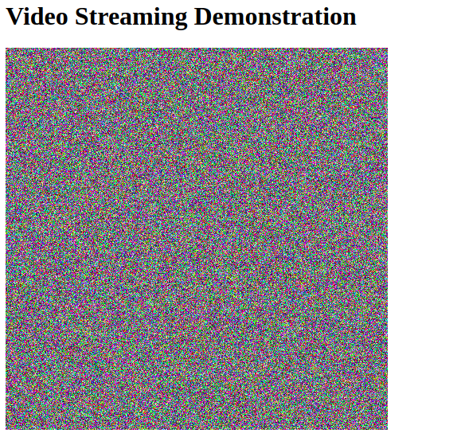

MJPEG live streaming server has features:
+ Backend using Flask
+ Automatically recycle old images
+ Easy to integrate to web application with only an image tag
+ Cross-platform supported
+ Set up in one command line with Docker

Python backend source code is greatly inspired by [`Miguel Grinberg`](https://blog.miguelgrinberg.com/author/Miguel%20Grinberg).

# USAGE

1. Build and start Motion JPEG Server:
$ docker-compose up -d

2. Simulate a simple stream:
$ python test_mjpeg.py

3. View the stream locally by opening **show_mjpeg.html** file with your browser.

4. Optionally configure nginx with the template at **nginx_mjpeg.conf**. Check the stream by using **show_mjpeg_nginx.html**

**screenshot:**

